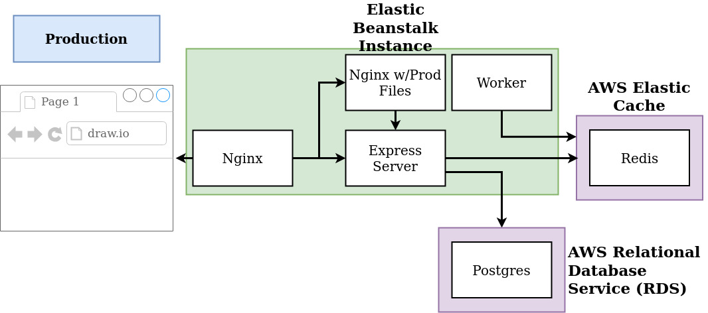

# Building Multi-Container Application And Deploying to AWS Elastic Beanstalk Using Travis CI

## Containers
- Nginx
- Redis (AWS Elasticache)
- Postgres (AWS RDS)
- React (client)
- Express (api server)
- Worker (calculator)

## Descriptions
- Browser sends the request to Nginx server, which routes the request to respective location
- Request coming from browser with '/' path requesting (HTML or JS) is directed to react/client server located at port 3000.
- Request coming from browser with '/api' path (submitting or retrieving values) is directed to express/api server located at port 5000
- All the submitted values are stored in Postgres database for permanent storage
- All the submitted and calculated values are stored in Redis database as key-value pairs
- If the number submitted is previously seen, it will return the calculated value from Redis server, otherwise it is sent to worker container for the calculation
- Nginx, Express, React and Worker server are hosted on AWS Elastic Beanstalk
- Redis server is hosted on AWS Elasticache
- Postgres database server is hosted on AWS RDS
- Every new version is deployed on AWS EB, as we push our code changes to Github, which is build, tested and deployed using Travis CI

### Redis/Postgres is separated from AWS EB because:
- AWS automatically creates and maintains Redis/Postgres instance for us
- Super easy to scale
- Built in logging + maintenance
- Better security
- Easy to backups
